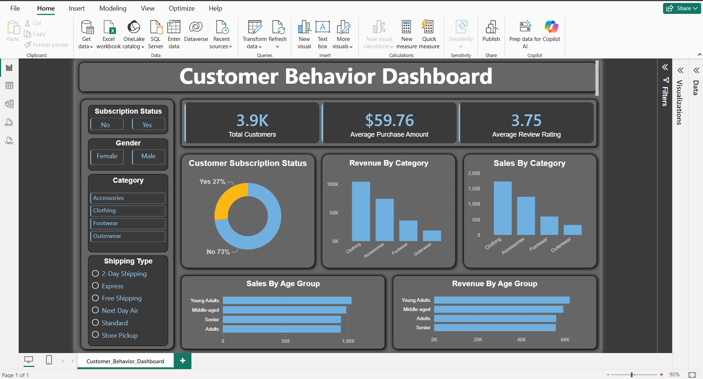

# 🛍️ Customer Shopping Behavior Analysis


**An end-to-end analytics project: 3,900 retail transactions taken from raw CSV through Python, PostgreSQL, SQL, and Power BI to uncover what actually drives spending, loyalty, and subscription conversion — plus a validated statistical extension that goes beyond the assigned brief.**

📷 **[Dashboard preview →](#dashboard-preview)** *(live link coming soon — see note below)*
📄 **[Full report (PDF) →](./Customer_Behavior_Analysis_Report.pdf)**
🎤 **[Stakeholder presentation (PPTX) →](./Customer_Behavior_Analysis_Presentation.pptx)**
🧪 **[Extension write-up →](./Extension_Beyond_The_Brief.md)**

---

## 📋 Table of Contents

- [Overview](#overview)
- [Key Results at a Glance](#key-results-at-a-glance)
- [Skills Demonstrated](#skills-demonstrated)
- [Problem Statement](#problem-statement)
- [Analytics Pipeline](#analytics-pipeline)
- [Key Findings](#key-findings)
- [Extension: Beyond the Brief](#extension-beyond-the-brief)
- [Exploratory Data Analysis](#exploratory-data-analysis)
- [Repo Structure](#repo-structure)
- [Tech Stack](#tech-stack)
- [How to Run](#how-to-run)
- [Dashboard Preview](#dashboard-preview)
- [Business Recommendations](#business-recommendations)
- [Limitations](#limitations)
- [Author](#author)

---

## Overview

A retail company wants to understand what drives customer purchasing decisions and repeat behavior — discounts, reviews, seasonality, payment method — in order to improve engagement and product strategy. This project answers that with a full analytics pipeline: **Python** for cleaning and feature engineering, **PostgreSQL** for a simulated business transactions store, **SQL** for ten targeted business questions, **Power BI** for stakeholder-facing visualization, and a **statistical extension** (logistic regression + clustering) that goes beyond what was assigned.

> [!NOTE]
> The full assignment brief is in [`Problem_Statement_and_Deliverables.pdf`](./Problem_Statement_and_Deliverables.pdf).

## 🏆 Key Results at a Glance

| Metric | Value |
|---|---|
| Transactions analyzed | **3,900** |
| Total revenue analyzed | **$233,081** |
| Customers classified "Loyal" (11+ previous purchases) | **79.9%** |
| Subscription conversion rate | **27%** |
| Subscription predictable from behavior? *(extension)* | **No** — ROC AUC 0.469, no better than random |
| New customer segment surfaced *(extension)* | **984 customers** missed by the current loyalty tiers |

## 🧠 Skills Demonstrated

| Skill | Where it shows up |
|---|---|
| Data cleaning, missing-value imputation, feature engineering | [`Data_Cleaning.ipynb`](./Data_Cleaning.ipynb) |
| Relational database design & ETL into PostgreSQL | [`Data_Cleaning.ipynb`](./Data_Cleaning.ipynb), [`.env.example`](./.env.example) |
| SQL — aggregation, `CASE WHEN` segmentation, window functions | [`Customer_Behavior_Data_Cleaning.sql`](./Customer_Behavior_Data_Cleaning.sql) |
| BI dashboard design — KPI cards, slicers, cross-filtering | [`PowerBI_Viz/`](./PowerBI_Viz) |
| Statistical modeling — logistic regression, data-leakage detection | [`predictive_analysis.py`](./predictive_analysis.py) |
| Unsupervised learning — K-means clustering, silhouette-based model selection | [`predictive_analysis.py`](./predictive_analysis.py) |
| Stakeholder communication — written report + slide deck | [`Customer_Behavior_Analysis_Report.pdf`](./Customer_Behavior_Analysis_Report.pdf), [`Customer_Behavior_Analysis_Presentation.pptx`](./Customer_Behavior_Analysis_Presentation.pptx) |
| Reproducibility & repo hygiene | `requirements.txt`, `.env.example`, `.gitignore` |

## Problem Statement

> *"How can the company leverage consumer shopping data to identify trends, improve customer engagement, and optimize product strategy?"*

Management has observed shifts in purchasing patterns across demographics, product categories, and sales channels, and wants to know which factors — discounts, reviews, seasonality, payment preferences — most influence purchase decisions and repeat behavior.

## Analytics Pipeline

```
data/raw/E-Commerce_Data.csv (3,900 rows × 18 cols)
      │
      ▼
Python (pandas) — cleaning, imputation, feature engineering
      │
      ├──▶ data/processed/output_data.xlsx (cleaned output)
      │
      ▼
PostgreSQL (SQLAlchemy + psycopg2) — simulated transactions store
      │
      ▼
SQL — 10 business questions answered via aggregation, CASE WHEN, window functions
      │
      ▼
Power BI — interactive single-page dashboard with slicers
      │
      ▼
Extension — logistic regression + K-means clustering (beyond the brief)
```

## Key Findings

| # | Question | Finding |
|---|---|---|
| 1 | Revenue by gender | Male customers generate **$157,890** vs. **$75,191** for female customers |
| 5 | Subscribers vs. non-subscribers | Avg. spend is nearly identical (~$59.50 both); non-subscribers drive **73%** of revenue |
| 7 | Customer segments (Loyal = 11+ previous purchases) | **79.9%** Loyal · 18.0% Returning · 2.1% New |
| 9 | Repeat buyers (>5 previous purchases) → subscription? | No correlation — repeat buyers subscribe at ~27.6%, same as the overall base |

Full results for all 10 questions are in the [report](./Customer_Behavior_Analysis_Report.pdf) and the [SQL file](./Customer_Behavior_Data_Cleaning.sql).

## 🧪 Extension: Beyond the Brief

*Not part of the assigned deliverables — added to go a layer deeper than "what happened."*

- **A logistic regression tested whether customer behavior predicts subscription.** Two features (`gender`, `discount_applied`) turned out to be 100%-pure artifacts of this synthetic dataset rather than genuine signal, and were excluded after a leakage check. With them removed, **no legitimate behavioral factor predicts subscription** (ROC AUC 0.469) — a statistically rigorous confirmation of Finding #9 above.
- **K-means clustering on purchase count × spend** surfaced a **984-customer, high-spend/low-frequency segment** that the current purchase-count-only Loyal/Returning/New tiers can't see.

Full methodology, leakage-check output, and interpretation: [`Extension_Beyond_The_Brief.md`](./Extension_Beyond_The_Brief.md).

## 📈 Exploratory Data Analysis

Distribution and correlation checks run in `Data_Cleaning.ipynb` before feature engineering:

| Distributions | Outlier Check | Correlation |
|---|---|---|
| [`Insights/Hist_plot.png`](./Insights/Hist_plot.png) | [`Insights/Box_plot.png`](./Insights/Box_plot.png) | [`Insights/Matrix.png`](./Insights/Matrix.png) |

Age, purchase amount, review rating, and previous purchases are all close to uniformly distributed with no significant outliers — and the correlation matrix shows essentially no linear relationship between any pair of numeric features (all correlations under 0.05), which is consistent with the extension's finding that behavior alone doesn't explain subscription.

## 🗂️ Repo Structure

```
├── Data_Cleaning.ipynb                        # Python cleaning + feature engineering
├── predictive_analysis.py                     # Extension: logistic regression + clustering
├── Customer_Behavior_Data_Cleaning.sql         # all 10 business-question queries
├── data/
│   ├── raw/
│   │   └── E-Commerce_Data.csv                 # raw input
│   └── processed/
│       └── output_data.xlsx                    # cleaned, feature-engineered output
├── Insights/
│   ├── Hist_plot.png                           # EDA: distributions
│   ├── Box_plot.png                            # EDA: outlier check
│   ├── Matrix.png                              # EDA: correlation matrix
│   └── Dashboard_Report.png                    # Power BI dashboard screenshot
├── PowerBI_Viz/
│   ├── Customer_Behavior_Dashboard.pbit         # Power BI template (needs DB reconnect — see note)
│   └── Dashboard_Export.pdf                     # static, standalone dashboard export
├── Customer_Behavior_Analysis_Report.pdf
├── Problem_Statement_and_Deliverables.pdf
├── Customer_Behavior_Analysis_Presentation.pptx
├── Extension_Beyond_The_Brief.md               # write-up of the predictive/clustering extension
├── requirements.txt
├── .env.example
├── .gitignore
└── README.md
```

> [!TIP]
> Two files above need a quick manual rename on your machine before this structure is fully accurate — see the note at the top of [How to Run](#how-to-run).

## 🛠️ Tech Stack

| Layer | Tool |
|---|---|
| Data prep & feature engineering | Python (pandas, scikit-learn) |
| Database | PostgreSQL (SQLAlchemy + psycopg2) |
| Analysis | SQL (aggregation, `CASE WHEN`, window functions) |
| Visualization | Power BI |
| Statistical extension | scikit-learn (LogisticRegression, KMeans) |
| Version control | Git / GitHub |

## ▶️ How to Run

> [!IMPORTANT]
> Before your first commit, rename three files so the repo structure above is accurate:
> 1. `PowerBI_Viz/Customer_Behavior_Dashboard (1).pbit` → `PowerBI_Viz/Customer_Behavior_Dashboard.pbit`
> 2. `PowerBI_Viz/Customer_Behavior_Dashboard_pdf.pbit` → `PowerBI_Viz/Dashboard_Export.pdf` (this file is actually a PDF, not a Power BI file — it just has the wrong extension)
> 3. `Problem Statement & Deliverables.pdf` → `Problem_Statement_and_Deliverables.pdf` (removes spaces, which otherwise break markdown links)

1. Clone the repo and install dependencies — use `python -m pip`, not a bare `pip`, so packages land in the interpreter you'll actually run:
   ```
   python -m pip install -r requirements.txt
   ```
2. Copy `.env.example` to `.env` and fill in your own PostgreSQL credentials (never commit `.env`).
3. Run `Data_Cleaning.ipynb` to clean `data/raw/E-Commerce_Data.csv`, produce `data/processed/output_data.xlsx`, and load the result into PostgreSQL.
4. Run the queries in `Customer_Behavior_Data_Cleaning.sql` against the loaded table, or open `PowerBI_Viz/Customer_Behavior_Dashboard.pbit` in Power BI Desktop and reconnect it to your own database to explore the live dashboard (it's a template file, so it needs a working PostgreSQL connection to load data — for a no-setup preview, open `PowerBI_Viz/Dashboard_Export.pdf` instead).
5. *(Extension, optional)* Run `python predictive_analysis.py` for the subscription-prediction model and customer clustering — see [`Extension_Beyond_The_Brief.md`](./Extension_Beyond_The_Brief.md) for what it found.

## 📷 Dashboard Preview



> [!TIP]
> This is a static screenshot. A short screen-recording of the slicers in action (converted to GIF) will replace this once available — interactivity is the actual point of the Power BI deliverable.

## 💡 Business Recommendations

- **Convert non-subscribers.** Spend is flat across subscription status, so the 73%-of-revenue non-subscriber base is the largest growth lever — not price, but visibility of subscriber benefits.
- **Build a loyalty tier for repeat buyers.** Being a frequent purchaser doesn't currently predict subscription — a structured rewards program could close that gap.
- **Review discount dependency.** Five products (Hat, Sneakers, Coat, Sweater, Pants) sell at a discount roughly half the time — worth a margin review.
- **Target the high-spend/low-frequency segment differently.** The 984-customer group surfaced in the extension analysis needs a spend-based re-engagement approach, not a frequency-based loyalty push.
- **Grow the female customer segment.** Currently under half of male revenue despite a smaller but non-trivial customer base.

## ⚠️ Limitations

- **Single-snapshot data.** Each row is one customer with no transaction date, so there's no true recency analysis, cohort tracking, or time-series trend — despite the original brief asking about changes in purchasing patterns over time.
- **Synthetic-data artifacts.** Two features (`gender`, `discount_applied`) show a 100%-pure split against subscription status that isn't plausible as real-world behavior. They were identified and excluded in the extension model — see [`Extension_Beyond_The_Brief.md`](./Extension_Beyond_The_Brief.md) for details.
- **The predictive model is not deployable.** Its finding (no behavioral predictor of subscription exists in this data) is a valid analytical result, not a targeting tool — it should be read as evidence, not as a production model.
- **The Power BI file is a template, not a standalone report.** `Customer_Behavior_Dashboard.pbit` needs a live PostgreSQL connection to load data; it won't show visuals out of the box for someone who clones the repo without also setting up the database. `Dashboard_Export.pdf` is the reliable no-setup preview.

## 👤 Author

**M Fadil Ahmed** — Data Science Student / Analyst
